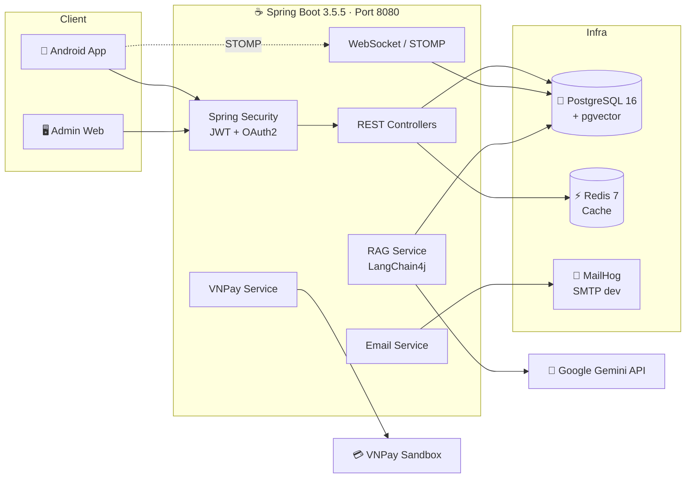
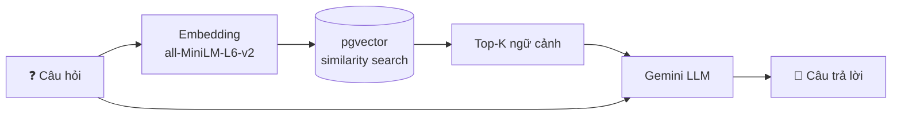

<div align="center">

# 👟 BE-Nice — Nike Store Backend

**Backend API cho hệ thống thương mại điện tử Nike Store**
Spring Boot 3 · PostgreSQL + pgvector · Redis · WebSocket · RAG Chatbot (Gemini)

[](https://openjdk.org/projects/jdk/17/)
[](https://spring.io/projects/spring-boot)
[](https://www.postgresql.org/)
[](https://redis.io/)
[](https://docs.langchain4j.dev/)
[](http://localhost:8080/swagger-ui.html)
[](https://maven.apache.org/)

</div>

---

## 📑 Mục lục

- [Giới thiệu](#-giới-thiệu)
- [Tính năng chính](#-tính-năng-chính)
- [Kiến trúc hệ thống](#-kiến-trúc-hệ-thống)
- [Công nghệ sử dụng](#-công-nghệ-sử-dụng)
- [Yêu cầu môi trường](#-yêu-cầu-môi-trường)
- [Bắt đầu nhanh (Quick Start)](#-bắt-đầu-nhanh-quick-start)
- [Cấu hình](#️-cấu-hình)
- [Cấu trúc thư mục](#-cấu-trúc-thư-mục)
- [Tài liệu API](#-tài-liệu-api)
- [Realtime Chat (WebSocket)](#-realtime-chat-websocket)
- [RAG Chatbot](#-rag-chatbot)
- [Thanh toán VNPay](#-thanh-toán-vnpay)
- [Database & Migration](#-database--migration)
- [Cảnh báo bảo mật](#-cảnh-báo-bảo-mật)
- [Xử lý sự cố](#-xử-lý-sự-cố)
- [Tài liệu chi tiết](#-tài-liệu-chi-tiết)

---

## 🎯 Giới thiệu

**BE-Nice** là backend RESTful API phục vụ ứng dụng bán giày Nike (client Android + trang quản trị). Dự án được tổ chức theo **kiến trúc module hoá theo domain** (`product`, `order`, `cart`, `loyalty`, `chatbot`…), mỗi module tự chứa `controller / service / repository / entity / dto`.

Ngoài các nghiệp vụ e-commerce tiêu chuẩn, hệ thống còn tích hợp:

- 🤖 **Chatbot RAG** tư vấn sản phẩm bằng Google Gemini + vector search trên pgvector
- 💬 **Chat realtime** giữa khách hàng và admin qua WebSocket/STOMP
- 🎰 **Gamification**: vòng quay may mắn, điểm thưởng, điểm danh hàng ngày
- 🔔 **Hệ thống thông báo** đa loại sự kiện
- 💳 **Thanh toán VNPay** (sandbox)

---

## ✨ Tính năng chính

<table>
<tr><th width="180">Nhóm</th><th>Chi tiết</th></tr>

<tr><td>

**🔐 Xác thực & Phân quyền**

</td><td>

Đăng ký / đăng nhập JWT (access + refresh token), xác thực qua **OTP email**, quên mật khẩu (link token hoặc OTP), đổi mật khẩu, đăng nhập **OAuth2 Google / Facebook**, phân quyền `USER` / `ADMIN`

</td></tr>

<tr><td>

**🛍️ Sản phẩm & Danh mục**

</td><td>

CRUD sản phẩm, biến thể **màu sắc / size**, lọc đa tiêu chí, tìm kiếm, gợi ý (suggestions), sản phẩm nổi bật, thống kê theo brand & category, quản lý danh mục

</td></tr>

<tr><td>

**🛒 Giỏ hàng & Đơn hàng**

</td><td>

Giỏ hàng theo user (trigger DB đồng bộ), đặt hàng, huỷ đơn, xem lịch sử, **đặt lại đơn cũ** (reorder), snapshot thông tin sản phẩm tại thời điểm mua, admin cập nhật trạng thái & ghi chú

</td></tr>

<tr><td>

**❤️ Yêu thích & Đánh giá**

</td><td>

Thêm/xoá yêu thích, đếm & kiểm tra nhanh; đánh giá sao + bình luận, **admin trả lời review**, duyệt / từ chối / khôi phục, duyệt hàng loạt, cấm user spam review

</td></tr>

<tr><td>

**🎁 Khuyến mãi**

</td><td>

Mã giảm giá (theo % hoặc số tiền), áp mã vào đơn, coupon riêng của từng user, kiểm tra hạn dùng, dọn coupon hết hạn, thống kê sử dụng

</td></tr>

<tr><td>

**🪙 Loyalty & Gamification**

</td><td>

Nike Coin, lịch sử giao dịch điểm, **điểm danh hàng ngày** kèm streak, **vòng quay may mắn** (1 lượt free/ngày + quay bằng coin), admin cấu hình phần thưởng & tỉ lệ

</td></tr>

<tr><td>

**🔔 Thông báo**

</td><td>

Thông báo theo user, đếm chưa đọc, đánh dấu đã đọc (đơn / tất cả), xoá, thống kê, admin **broadcast** toàn hệ thống hoặc gửi riêng 1 user

</td></tr>

<tr><td>

**💬 Chat & Chatbot**

</td><td>

Chat realtime user ↔ admin (STOMP + SockJS), lịch sử hội thoại, đếm tin chưa đọc; chatbot RAG trả lời dựa trên dữ liệu sản phẩm thật, **tự động đồng bộ khi có sản phẩm mới**

</td></tr>

<tr><td>

**📍 Người dùng & Địa chỉ**

</td><td>

Hồ sơ cá nhân, upload avatar, sổ địa chỉ nhiều mục + đặt địa chỉ mặc định

</td></tr>

<tr><td>

**📊 Admin Dashboard**

</td><td>

Thống kê tổng quan (user / sản phẩm / đơn hàng), biểu đồ doanh thu & đơn hàng, top sản phẩm, hoạt động gần đây, cảnh báo, export báo cáo

</td></tr>

</table>

---

## 🏗 Kiến trúc hệ thống



**Luồng bên trong mỗi module** — mỗi package là một bounded context độc lập:

```
controller → service → repository → entity
     ↑            ↓
    dto  ←→  mapper (MapStruct)
```

---

## 🧰 Công nghệ sử dụng

| Lớp | Công nghệ |
|---|---|
| **Ngôn ngữ / Runtime** | Java 17 |
| **Framework** | Spring Boot 3.5.5 (Web, Data JPA, Validation, Actuator, Mail, WebSocket) |
| **Bảo mật** | Spring Security, OAuth2 Client + Resource Server, JJWT 0.11.5, BCrypt |
| **Database** | PostgreSQL 16, `pgvector` 0.1.4, Hibernate, Hypersistence Utils (JSON type) |
| **Cache** | Redis 7 (Spring Data Redis, TTL 10 phút) |
| **AI / RAG** | LangChain4j 0.35.0, Google Gemini, `all-MiniLM-L6-v2` embeddings, DJL Tokenizers, PDFBox 3.0.3 |
| **Mapping / Boilerplate** | MapStruct 1.5.5, Lombok 1.18.30 |
| **API Docs** | SpringDoc OpenAPI 2.8.5 (Swagger UI) |
| **View (admin legacy)** | Thymeleaf + Layout Dialect, SiteMesh 3.2.0 |
| **Thanh toán** | VNPay (HMAC-SHA512, sandbox) |
| **Build / Deploy** | Maven Wrapper, Docker Compose |

---

## 📋 Yêu cầu môi trường

| Thành phần | Phiên bản | Ghi chú |
|---|---|---|
| JDK | **17** | Bắt buộc — project compile target 17 |
| Maven | 3.9+ | Có thể dùng `./mvnw` kèm sẵn trong repo |
| Docker + Docker Compose | Mới nhất | Chạy PostgreSQL / Redis / MailHog |
| RAM trống | ≥ 4 GB | Model embedding nạp vào bộ nhớ khi khởi động |

**Cổng sử dụng:** `8080` (app) · `5432` (PostgreSQL) · `6379` (Redis) · `1025` (SMTP) · `8025` (MailHog UI)

---

## 🚀 Bắt đầu nhanh (Quick Start)

### 1️⃣ Clone dự án

```bash
git clone https://github.com/TPZ1WZ/BE-Nice-develop.git
cd BE-Nice-develop
```

### 2️⃣ Khởi động hạ tầng

> **Khuyến nghị** dùng `docker-compose.yml` — đã có sẵn **pgvector** (bắt buộc cho chatbot), Redis và MailHog.

```bash
docker compose up -d postgres redis mailhog
```

Kiểm tra container đã chạy:

```bash
docker compose ps
```

<details>
<summary>🔁 Cách thay thế: chỉ chạy PostgreSQL thuần (không dùng chatbot)</summary>

```bash
# Linux
sudo docker compose -f postgreSQL.yaml up -d --build

# Windows
docker compose -f postgreSQL.yaml up -d --build
```

⚠️ File này dùng image `postgres:16` **không có pgvector**, và user là `cps/cps` (khác `cps_user/cps_pass` trong `application.properties`) — cần sửa datasource cho khớp.

</details>

### 3️⃣ Cấu hình API key

Mở `src/main/resources/application.properties` và điền khoá của bạn:

```properties
gemini.api.key=<GOOGLE_GEMINI_API_KEY>
spring.mail.username=<EMAIL_CỦA_BẠN>
spring.mail.password=<GMAIL_APP_PASSWORD>
```

> 🔑 Lấy Gemini API key miễn phí tại [Google AI Studio](https://aistudio.google.com/app/apikey).

### 4️⃣ Build & chạy

```bash
# Build (bỏ qua test)
./mvnw clean install -DskipTests

# Chạy ứng dụng
./mvnw spring-boot:run
```

<details>
<summary>🪟 Windows (PowerShell / CMD)</summary>

```powershell
.\mvnw.cmd clean install -DskipTests
.\mvnw.cmd spring-boot:run
```

</details>

### 5️⃣ Kiểm tra

| Dịch vụ | URL |
|---|---|
| 🌐 API Base | http://localhost:8080 |
| 📖 Swagger UI | http://localhost:8080/swagger-ui.html |
| 📄 OpenAPI JSON | http://localhost:8080/v3/api-docs |
| 📧 MailHog (xem mail test) | http://localhost:8025 |
| ❤️ Health check | http://localhost:8080/actuator/health |
| 🤖 Chatbot health | http://localhost:8080/api/v1/chat/health |

> ⏱ Lần khởi động đầu tiên mất **30–60 giây** do phải tải model embedding và index dữ liệu sản phẩm.

---

## ⚙️ Cấu hình

Toàn bộ cấu hình nằm trong [`src/main/resources/application.properties`](src/main/resources/application.properties).

### Database

```properties
spring.datasource.url=jdbc:postgresql://localhost:5432/cps_db?TimeZone=Asia/Ho_Chi_Minh
spring.datasource.username=cps_user
spring.datasource.password=cps_pass
spring.jpa.hibernate.ddl-auto=update
```

### JWT & Cookie

| Thuộc tính | Mặc định | Ý nghĩa |
|---|---|---|
| `jwt.secret` | *(chuỗi dài)* | Khoá ký HMAC-SHA256 |
| `jwt.access-token-expiration.ms` | `36000000` | Access token — 10 giờ |
| `jwt.refresh-token-expiration.ms` | `86400000` | Refresh token — 24 giờ |
| `server.servlet.session.cookie.http-only` | `true` | Chặn JS đọc cookie |
| `server.servlet.session.cookie.same-site` | `strict` | Hạn chế gửi cookie cross-site |

### Chatbot RAG

| Thuộc tính | Mặc định | Ý nghĩa |
|---|---|---|
| `gemini.api.key` | — | **Bắt buộc** để chatbot trả lời |
| `chatbot.embedding.model` | `all-MiniLM-L6-v2` | Model sinh vector (chạy local) |
| `chatbot.chunk.size` | `500` | Kích thước 1 chunk văn bản |
| `chatbot.chunk.overlap` | `100` | Độ chồng lấn giữa các chunk |
| `chatbot.retrieval.top-k` | `5` | Số đoạn ngữ cảnh lấy ra |
| `chatbot.retrieval.similarity-threshold` | `0.5` | Ngưỡng tương đồng tối thiểu |

### OAuth2

```properties
spring.security.oauth2.client.registration.google.client-id=<CLIENT_ID>
spring.security.oauth2.client.registration.google.client-secret=<CLIENT_SECRET>
spring.security.oauth2.client.registration.facebook.client-id=<APP_ID>
spring.security.oauth2.client.registration.facebook.client-secret=<APP_SECRET>
```

---

## 📁 Cấu trúc thư mục

```
BE-Nice-develop/
├── src/main/java/com/proj/webprojrct/
│   ├── address/          # 📍 Sổ địa chỉ giao hàng
│   ├── admin/            # 📊 Dashboard, quản lý user / sản phẩm / đơn hàng
│   ├── auth/             # 🔐 Đăng ký, đăng nhập, OTP, JWT
│   ├── cart/             # 🛒 Giỏ hàng
│   ├── category/         # 🗂 Danh mục sản phẩm
│   ├── chat/             # 💬 Chat realtime user ↔ admin (WebSocket)
│   ├── chatbot/          # 🤖 RAG chatbot (embedding, retrieval, LLM)
│   ├── common/           # 🧩 Config, security, exception, mapper, util
│   ├── config/           # ⚙️ Swagger, SiteMesh, MVC, error handler
│   ├── email/            # 📧 Gửi mail (OTP, xác nhận đơn, reset password)
│   ├── favorite/         # ❤️ Sản phẩm yêu thích
│   ├── loyalty/          # 🪙 Nike Coin, điểm danh, lịch sử điểm
│   ├── luckywheel/       # 🎰 Vòng quay may mắn
│   ├── notification/     # 🔔 Hệ thống thông báo
│   ├── order/            # 📦 Đơn hàng, callback thanh toán
│   ├── payment/          # 💳 Tích hợp VNPay
│   ├── product/          # 👟 Sản phẩm, màu sắc, size
│   ├── promotion/        # 🎁 Mã giảm giá / coupon
│   ├── review/           # ⭐ Đánh giá & phản hồi
│   └── user/             # 👤 Hồ sơ người dùng
├── src/main/resources/
│   ├── application.properties
│   ├── chatbot.properties
│   ├── vector-init.sql       # Khởi tạo extension pgvector
│   └── data.sql              # Dữ liệu mẫu
├── db/                       # 🗄 Script migration theo tính năng
├── docker-compose.yml        # PostgreSQL(pgvector) + Redis + MailHog + App
├── postgreSQL.yaml           # Chỉ PostgreSQL (bản gọn)
└── pom.xml
```

---

## 📖 Tài liệu API

Swagger UI liệt kê đầy đủ request/response schema. Dưới đây là bản đồ endpoint tổng quan.

<details open>
<summary><b>🔐 Authentication — <code>/api/v1/auth</code></b></summary>

| Method | Endpoint | Mô tả |
|---|---|---|
| `POST` | `/register` | Đăng ký tài khoản |
| `POST` | `/register-with-otp` | Đăng ký, gửi OTP về email |
| `POST` | `/verify-registration-otp` | Xác thực OTP đăng ký |
| `POST` | `/resend-registration-otp` | Gửi lại OTP |
| `POST` | `/login` | Đăng nhập, trả access + refresh token |
| `POST` | `/refresh` | Làm mới access token |
| `POST` | `/logout` | Đăng xuất, thu hồi token |
| `GET` | `/info` | Thông tin phiên đăng nhập hiện tại |
| `POST` | `/forgot-password` | Gửi link đặt lại mật khẩu |
| `GET` | `/verify/{token}` | Xác thực link reset |
| `POST` | `/reset-password` | Đặt lại mật khẩu bằng token |
| `POST` | `/forgot-password-otp` | Gửi OTP đặt lại mật khẩu |
| `POST` | `/verify-password-reset-otp` | Xác thực OTP reset |
| `POST` | `/reset-password-with-otp` | Đặt lại mật khẩu bằng OTP |
| `POST` | `/change-password` | Đổi mật khẩu (đã đăng nhập) |

</details>

<details>
<summary><b>👟 Sản phẩm — <code>/api/v1/products</code></b></summary>

| Method | Endpoint | Mô tả |
|---|---|---|
| `GET` | `/products` | Danh sách sản phẩm (phân trang) |
| `GET` | `/products/{id}` | Chi tiết sản phẩm |
| `GET` | `/products/search` | Tìm kiếm theo từ khoá |
| `GET` `POST` | `/products/filter` | Lọc đa tiêu chí |
| `GET` | `/products/featured` | Sản phẩm nổi bật |
| `GET` | `/products/brands` | Danh sách thương hiệu |
| `GET` | `/products/categories` | Danh sách danh mục |
| `GET` | `/products/suggestions` | Gợi ý tìm kiếm |
| `POST` | `/products` | Tạo sản phẩm *(admin)* |
| `PATCH` | `/products/{id}` | Cập nhật sản phẩm *(admin)* |
| `DELETE` | `/products/{id}` | Xoá sản phẩm *(admin)* |

</details>

<details>
<summary><b>🛒 Giỏ hàng & Đơn hàng</b></summary>

**Giỏ hàng — `/api/v1/carts`**

| Method | Endpoint | Mô tả |
|---|---|---|
| `GET` | `/` | Xem giỏ hàng |
| `GET` | `/count` | Số lượng item |
| `POST` | `/add` | Thêm sản phẩm |
| `PATCH` | `/update` | Cập nhật số lượng |
| `DELETE` | `/remove` | Xoá sản phẩm |
| `POST` | `/reorder/{orderId}` | Đặt lại đơn hàng cũ |

**Đơn hàng — `/api/v1/orders`**

| Method | Endpoint | Mô tả |
|---|---|---|
| `POST` | `/` | Tạo đơn hàng |
| `GET` | `/` | Lịch sử đơn hàng |
| `GET` | `/{orderId}` | Chi tiết đơn |
| `PATCH` | `/{orderId}/cancel` | Huỷ đơn |
| `GET` | `/vnpay/callback` | Callback từ VNPay |

</details>

<details>
<summary><b>⭐ Đánh giá — <code>/api/v1/reviews</code></b></summary>

| Method | Endpoint | Mô tả |
|---|---|---|
| `POST` | `/` | Tạo đánh giá |
| `GET` | `/product/{productId}` | Đánh giá của sản phẩm |
| `GET` | `/product/{productId}/summary` | Thống kê sao trung bình |
| `GET` | `/product/{productId}/search` | Tìm trong đánh giá |
| `GET` | `/product/{productId}/sorted` | Sắp xếp đánh giá |
| `POST` | `/filter` | Lọc đánh giá |
| `PUT` | `/{reviewId}` | Sửa đánh giá |
| `POST` | `/{reviewId}/replies` | Trả lời đánh giá |
| `GET` | `/{reviewId}/replies` | Danh sách trả lời |

</details>

<details>
<summary><b>🪙 Loyalty & 🎰 Lucky Wheel</b></summary>

**Loyalty — `/api/v1/loyalty`**

| Method | Endpoint | Mô tả |
|---|---|---|
| `GET` | `/points` | Số dư Nike Coin |
| `GET` | `/checkin/streak` | Chuỗi điểm danh |
| `POST` | `/checkin` | Điểm danh hôm nay |
| `GET` | `/transactions` | Lịch sử biến động điểm |

**Lucky Wheel — `/api/v1/lucky-wheel`**

| Method | Endpoint | Mô tả |
|---|---|---|
| `GET` | `/info` | Thông tin vòng quay & lượt còn lại |
| `POST` | `/spin` | Quay (free 1 lượt/ngày, sau đó trừ coin) |
| `POST` | `/track-product/{productId}` | Ghi nhận lượt xem sản phẩm |

</details>

<details>
<summary><b>❤️ Yêu thích · 📍 Địa chỉ · 🎁 Coupon · 🔔 Thông báo</b></summary>

**Yêu thích — `/api/v1/favorites`**
`POST /{productId}` · `DELETE /{productId}` · `GET /` · `GET /check/{productId}` · `GET /count` · `GET /product-ids`

**Địa chỉ — `/api/user/addresses`**
`GET /` · `GET /default` · `POST /` · `PUT /{id}` · `DELETE /{id}` · `PUT /{id}/set-default`

**Coupon — `/api/v1/coupons`**
`GET /available` · `GET /code/{code}` · `POST /apply` · `POST /{code}/use` · `GET /valid` · `GET /expired` · `GET /statistics`

**Thông báo — `/api/notifications`**
`GET /` · `GET /unread` · `GET /count-unread` · `PUT /{id}/read` · `PUT /read-all` · `DELETE /{id}` · `GET /statistics`

</details>

<details>
<summary><b>🛡 Admin</b></summary>

| Nhóm | Base path |
|---|---|
| Dashboard & thống kê | `/api/v1/admin/dashboard` |
| Quản lý người dùng | `/api/admin/users` |
| Quản lý sản phẩm | `/api/admin/products` |
| Quản lý danh mục | `/api/admin/categories` |
| Quản lý đơn hàng | `/api/v1/admin/orders` |
| Quản lý coupon | `/api/admin/coupons` |
| Kiểm duyệt đánh giá | `/api/v1/admin/reviews` |
| Cấu hình vòng quay | `/api/v1/admin/lucky-wheel` |
| Gửi thông báo | `/api/admin/notifications` |
| Cài đặt hệ thống | `/api/admin/settings` |

Dashboard cung cấp: `/statistics` · `/overview` · `/charts/revenue` · `/charts/orders` · `/top-products` · `/recent-activities` · `/alerts` · `/order-status` · `/export/summary`

</details>

---

## 🔌 Realtime Chat (WebSocket)

Hệ thống dùng **STOMP over WebSocket**, hỗ trợ cả SockJS (web) lẫn WebSocket thuần (mobile).

| Thông số | Giá trị |
|---|---|
| Endpoint | `ws://localhost:8080/ws-chat` |
| Prefix gửi tin | `/app` |
| Broker | `/topic`, `/queue` |
| Đích riêng từng user | `/user` |

REST bổ trợ tại `/api/v1/chat`:
`GET /history` · `GET /unread-count` · `POST /send` · `POST /messages/{messageId}/read` · `GET /admin/rooms` · `GET /admin/chat/{userId}` · `POST /admin/mark-read/{userId}`

---

## 🤖 RAG Chatbot

Chatbot trả lời câu hỏi về sản phẩm dựa trên **dữ liệu thật trong database**, hạn chế bịa thông tin.



**Tự động đồng bộ:** khi admin tạo / sửa / xoá sản phẩm, listener sẽ tự cập nhật vector index — không cần seed thủ công.

### Endpoint chatbot — `/api/v1/chat`

| Method | Endpoint | Mô tả |
|---|---|---|
| `POST` | `/` | Gửi câu hỏi, nhận câu trả lời |
| `GET` | `/conversations/{sessionId}` | Lịch sử theo phiên |
| `GET` | `/user/{userId}/conversations` | Lịch sử theo user |
| `GET` | `/health` | Trạng thái dịch vụ |
| `POST` | `/admin/upload-pdf` | Nạp tri thức từ file PDF |
| `POST` | `/admin/add-text` | Nạp tri thức dạng văn bản |
| `DELETE` | `/admin/documents/{source}` | Xoá tri thức theo nguồn |
| `POST` | `/admin/seed-products` | Index lại toàn bộ sản phẩm |
| `POST` | `/admin/seed-knowledge` | Nạp kho tri thức mặc định |
| `POST` | `/admin/reseed-all` | Xoá sạch và index lại tất cả |
| `GET` | `/admin/stats` | Số lượng document đã index |

📚 Chi tiết: [`CHATBOT_README.md`](CHATBOT_README.md) · [`CHATBOT_QUICKSTART.md`](CHATBOT_QUICKSTART.md) · [`CHATBOT_AUTO_SYNC.md`](CHATBOT_AUTO_SYNC.md)

---

## 💳 Thanh toán VNPay

Tích hợp cổng **VNPay sandbox**, ký giao dịch bằng `HMAC-SHA512`.

| Thông số | Giá trị |
|---|---|
| Payment URL | `https://sandbox.vnpayment.vn/paymentv2/vpcpay.html` |
| Query URL | `https://sandbox.vnpayment.vn/merchant_webapi/api/transaction` |
| Return URL | `http://10.0.2.2:8080/api/v1/orders/vnpay/callback` |
| Thời hạn giao dịch | 15 phút |

> ⚠️ Return URL đang trỏ tới `10.0.2.2` — địa chỉ loopback của **Android Emulator**. Khi chạy trên thiết bị thật hoặc deploy, hãy sửa `VN_PAY_RETURN_URL` trong [`payment/VnpayUtils.java`](src/main/java/com/proj/webprojrct/payment/VnpayUtils.java) thành domain thực tế.

---

## 🗄 Database & Migration

`spring.jpa.hibernate.ddl-auto=update` sẽ tự sinh schema từ entity. Thư mục [`db/`](db/) chứa script bổ sung cho từng tính năng:

| File | Nội dung |
|---|---|
| `init.sql` | Khởi tạo schema gốc |
| `vector_init.sql` | Bật extension `pgvector` + bảng vector |
| `addresses_migration.sql` | Bảng địa chỉ |
| `coupons_migration.sql` · `user_coupons_migration.sql` | Hệ thống mã giảm giá |
| `favorites_migration.sql` | Sản phẩm yêu thích |
| `loyalty_system_migration.sql` | Điểm thưởng & điểm danh |
| `lucky_wheel_migration.sql` · `lucky_wheel_update_migration.sql` | Vòng quay may mắn |
| `notifications_migration.sql` | Thông báo |
| `order_item_snapshot_migration.sql` | Snapshot sản phẩm trong đơn |

### Thao tác thường dùng

```bash
# Vào psql trong container
docker exec -it cps_postgres psql -U cps_user -d cps_db

# Reset sạch database (⚠️ mất toàn bộ dữ liệu)
docker compose down -v
docker compose up -d postgres redis mailhog
```

---

## 🔒 Cảnh báo bảo mật

> [!WARNING]
> Cấu hình hiện tại đang ở **chế độ phát triển**. Bắt buộc xử lý các điểm sau trước khi deploy production.

| # | Vấn đề | Vị trí | Hướng xử lý |
|---|---|---|---|
| 1 | **Toàn bộ endpoint đang `permitAll()`** — API không được bảo vệ | [`SecurityConfiguration.java`](src/main/java/com/proj/webprojrct/common/config/security/SecurityConfiguration.java) | Bật lại block `authorizeHttpRequests` đã comment sẵn trong file |
| 2 | **CSRF bị tắt** và **CORS cho phép mọi origin** (`*`) | `SecurityConfiguration.java` | Giới hạn origin cụ thể; bật CSRF cho endpoint dùng cookie |
| 3 | **Secret hardcode trong repo**: JWT secret, Gmail app password, Gemini API key | `application.properties` | Chuyển sang biến môi trường, thêm vào `.gitignore`, **thu hồi & cấp lại toàn bộ key đã lộ** |
| 4 | **VNPay TmnCode & secret key hardcode** | `VnpayUtils.java` | Đưa vào cấu hình ngoài, không commit |
| 5 | `ddl-auto=update` chạy trên production | `application.properties` | Đổi sang `validate` + dùng Flyway/Liquibase |
| 6 | Cookie `secure=false` | `application.properties` | Đặt `true` khi chạy HTTPS |

<details>
<summary>💡 Ví dụ chuyển secret sang biến môi trường</summary>

```properties
jwt.secret=${JWT_SECRET}
gemini.api.key=${GEMINI_API_KEY}
spring.mail.username=${MAIL_USERNAME}
spring.mail.password=${MAIL_PASSWORD}
spring.datasource.password=${DB_PASSWORD}
```

```bash
export JWT_SECRET="..."
export GEMINI_API_KEY="..."
./mvnw spring-boot:run
```

</details>

---

## 🩺 Xử lý sự cố

<details>
<summary><b>❌ <code>Connection refused</code> tới PostgreSQL</b></summary>

```bash
docker compose ps            # kiểm tra container có chạy không
docker compose logs postgres # xem log lỗi
```

Đảm bảo `spring.datasource.url/username/password` khớp với biến trong `docker-compose.yml` (`cps_db` / `cps_user` / `cps_pass`).

</details>

<details>
<summary><b>❌ <code>type "vector" does not exist</code></b></summary>

Bạn đang dùng image `postgres:16` thường thay vì `pgvector/pgvector:pg16`. Chuyển sang `docker-compose.yml`:

```bash
docker compose -f postgreSQL.yaml down -v
docker compose up -d postgres
```

</details>

<details>
<summary><b>❌ Chatbot trả lời "không có thông tin"</b></summary>

Vector index chưa được nạp dữ liệu:

```bash
curl -X POST http://localhost:8080/api/v1/chat/admin/reseed-all
curl http://localhost:8080/api/v1/chat/admin/stats   # kiểm tra số document
```

Xem thêm [`FIX_NO_DATA.md`](FIX_NO_DATA.md).

</details>

<details>
<summary><b>❌ Không nhận được email OTP</b></summary>

- **Môi trường dev**: mở MailHog tại http://localhost:8025 để xem mail
- **Gmail thật**: phải dùng **App Password** (bật 2FA trước), không dùng mật khẩu đăng nhập thường

</details>

<details>
<summary><b>❌ Port 8080 đã bị chiếm</b></summary>

```bash
./mvnw spring-boot:run -Dspring-boot.run.arguments=--server.port=8081
```

</details>

<details>
<summary><b>❌ Lỗi compile liên quan Lombok / MapStruct</b></summary>

Thường do IDE chưa bật annotation processing. Build sạch lại:

```bash
./mvnw clean install -DskipTests
```

</details>

---

## 📚 Tài liệu chi tiết

| Tài liệu | Nội dung |
|---|---|
| [`CHATBOT_README.md`](CHATBOT_README.md) | Kiến trúc RAG chatbot đầy đủ |
| [`CHATBOT_QUICKSTART.md`](CHATBOT_QUICKSTART.md) | Dựng chatbot trong 5 phút |
| [`CHATBOT_AUTO_SYNC.md`](CHATBOT_AUTO_SYNC.md) · [`AUTO_SYNC_CHATBOT.md`](AUTO_SYNC_CHATBOT.md) | Cơ chế tự đồng bộ sản phẩm |
| [`NOTIFICATION_FEATURE.md`](NOTIFICATION_FEATURE.md) | Thiết kế hệ thống thông báo |
| [`LUCKY_WHEEL_GUIDE.md`](LUCKY_WHEEL_GUIDE.md) | Vòng quay may mắn & tích hợp client |
| [`FORGOT_PASSWORD_IMPLEMENTATION.md`](FORGOT_PASSWORD_IMPLEMENTATION.md) | Luồng quên mật khẩu / OTP |
| [`REVIEW_SERVICE_COMPLETED.md`](REVIEW_SERVICE_COMPLETED.md) | Chi tiết module đánh giá |
| [`NIKE_STORE_FEATURES_COMPLETE.md`](NIKE_STORE_FEATURES_COMPLETE.md) | Tổng hợp toàn bộ tính năng |
| [`POSTMAN_TEST_COMMANDS.md`](POSTMAN_TEST_COMMANDS.md) | Bộ lệnh test API |
| [`FIX_NO_DATA.md`](FIX_NO_DATA.md) | Khắc phục chatbot thiếu dữ liệu |

---

<div align="center">

**Nike Store Backend** — xây dựng bằng Spring Boot 3 ☕

[⬆ Về đầu trang](#-be-nice--nike-store-backend)

</div>
